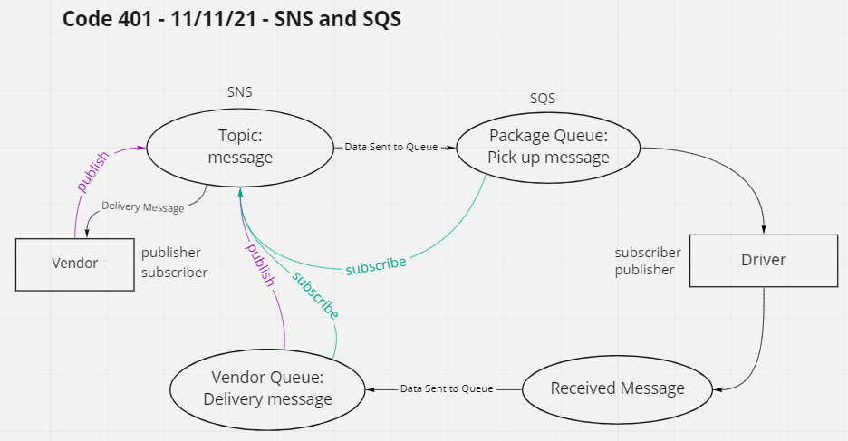

# caps-cloud

## UML

## Overview

Create a cloud version of the CAPS system

BRANCH NAME: `caps-cloud`
KUDOS: Tray Chea and I worked through this lab together including our UML.

### Required Services

1. SNS Topic: **pickup** which will receive all pickup requests from vendors
1. SQS Queue (FIFO): **packages** which will contain all delivery requests from vendors, in order of receipt.
    - Subscribe this queue to the **pickup** topic so all pickups are ordered
1. SQS Queue (Standard) for each vendor (named for the vendor) which will contain all delivery notifications from the drivers

### Operations

#### Vendors:

-   Vendors will post "pickup" messages containing delivery information into the SNS **pickup** topic
    -   `{ orderId: 1234, customer: "Jane Doe", vendorId: queueArn}`
    -   Note the `queueArn` -- this refers to the AWS 'arn' of the vendor's specific delivered queue
-   Pickup requests should be moved into a FIFO queue called **packages** for the drivers automatically
    -   (Make the packages queue a subscriber to the pickup topic)
-   Vendors should separately subscribe to their personal SQS queue and periodically poll the queue to see delivery notifications

#### Drivers:

-   Drivers will poll the SQS **packages** queue and retrieve only the next delivery order (message)
-   After a time (e.g. 5 seconds), drivers will post a message to the Vendor specific SQS Queue using the `queueArn` specified in the order object

## Implementation Notes

Work in a non-main branch in a new repository called "caps-cloud"

Once you have the appropriate queues and topics setup at SNS and SQS, you'll need some NodeJS applications running to get the system started

1. `vendor.js` should be an SQS Subscriber
    - Connect it to the pickup topic by using it's URL/ARN
        - Set it up to produce a new message to the "pickup" topic every few seconds, simulating an order
            - The order id and customer name can be randomized
            - Include the ARN to the vendor's personal delivery queue
    - Connect it to their own vendor queue by using it's URL/ARN
    - As drivers deliver, this app will continually poll the queue, retrieve them, and log details out to the console
    - You should be able to disconnect this app, and see deliveries that happened while the app was not running
1. `driver.js`
    - Connect to the **pickup** queue and get only the next package
    - Wait a random number of seconds
    - Post a message to the Vendor's "delivered" Queue (using the supplied arn in the order/message) to alert them of the delivery
    - Repeat until the queue is empty

> You should eventually be able to have multiple drivers and vendors wired up and acting in concert
